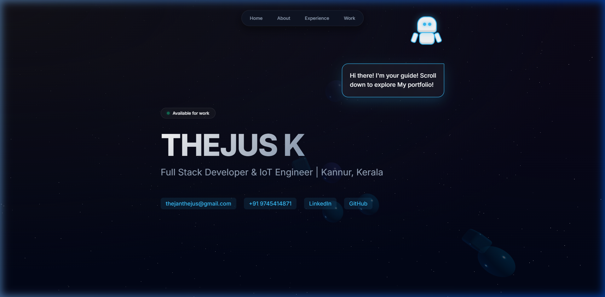

# 🌌 Thejus K - Full Stack & IoT Engineer Portfolio

Welcome to the source code for my interactive portfolio, designed from the ground up to feature specialized real-time animations, immersive glassmorphism, and a performant `@react-three` physics-enabled environment.



## ✨ Core Highlights

- **Dynamic Interactive Guide Bot**: Synthesized entirely via custom CSS, an adorable hovering robot autonomously guides visitors down the page with a contextual speech bubble, leans in on cursor targeting, and reliably backflips on-click.
- **Rapier Physics 3D Background**: The backdrop features thousands of drifting stars overlaid with bouncing, morphing glass objects utilizing `@react-three/drei` and `@react-three/rapier` 3D physics engines for a premium web experience.
- **Running Block Infinite Marquee**: All of my Full-Stack and IoT hardware projects glide endlessly through an interconnected horizontal block loop, featuring "click-to-pause" functionality.
- **Glassmorphism Aesthetic**: Extreme border radii, pill-shaped sticky navigation bars, glowing pulsing active dots, and specialized dark-mode `cubic-bezier` gradient loading sequences.

## 🚀 Tech Stack
- Frontend Framework: **React (Vite)**
- Styling Architecture: **Custom Pure CSS** (for complex pseudo-animations and keyframes)
- 3D Physics & Canvas: **Three.js**, **React Three Fiber**, **React Three Drei**, **Rapier3D**

## 💻 Running Locally

```bash
# Clone the respository
git clone https://github.com/Thejuskalyadan/portfolio-tk.git

# Navigate inside
cd portfolio-tk

# Install dependencies strictly mapping the package-lock
npm install

# Spin up the Vite development server
npm run dev
```

Visit the application at `http://localhost:5173`. 

## 🔧 About Me
I'm a postgraduate in Computer Science operating out of Kannur, Kerala. I specialize in seamlessly connecting robust full-stack platforms with real-world IoT microclimate sensors and wearable devices (e.g. `Vrishti Weather System`, `Hush Baby Alerts`). 

[](https://linkedin.com/in/ThejusKalyadan)
[](https://github.com/ThejusKalyadan)
